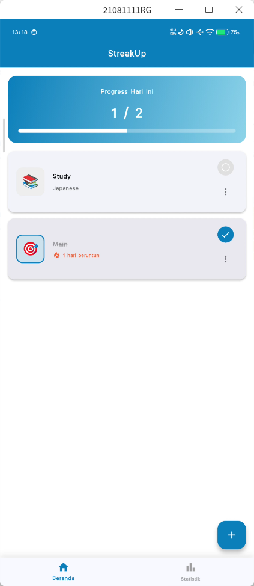
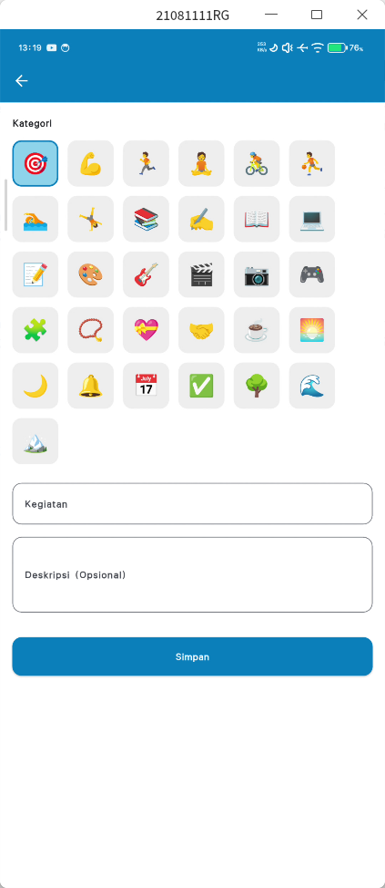
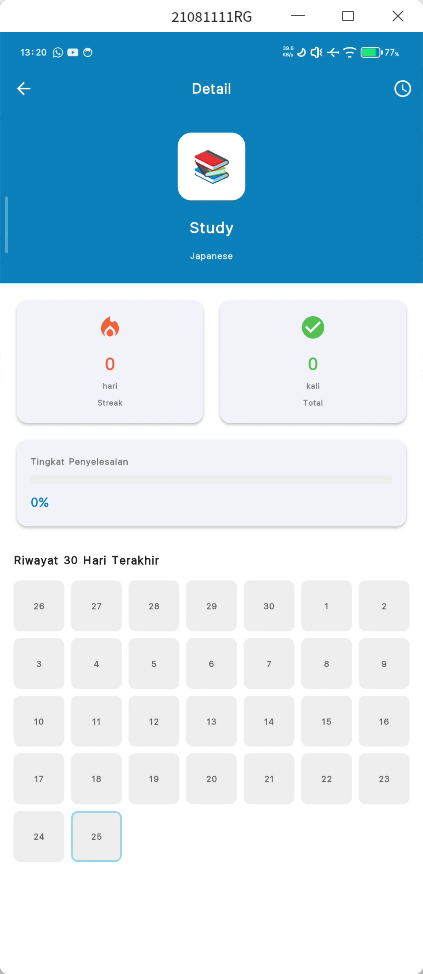
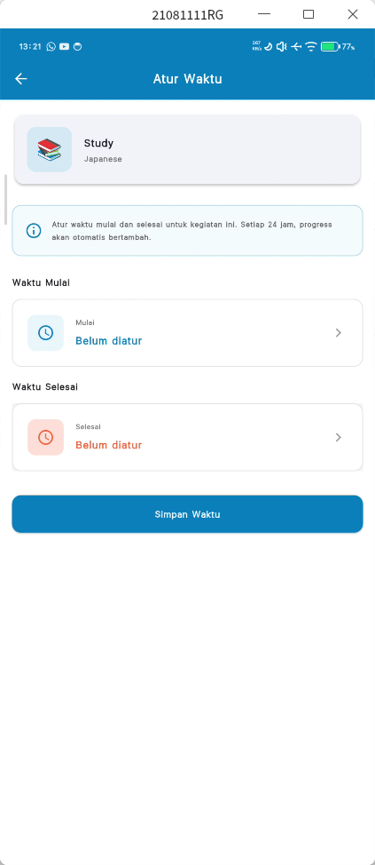
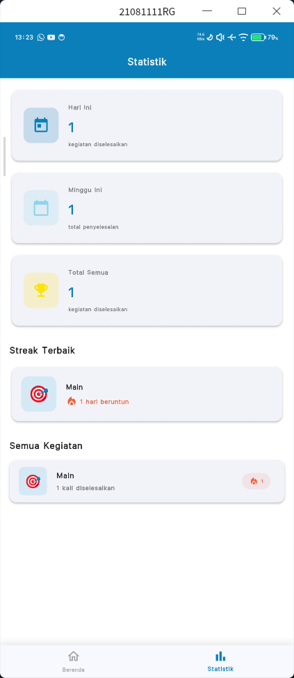

# 🌟 StreakUp

Projek gabut yang gw bikin sekalian belajar flutter, masih tahap prototipe.

---

# 📸 Snapshot

| Beranda | Add Habit | Detail Habit | Edit Waktu | Statistik |
|:--------:|:----------:|:-----------:|:--------------:|:-----------:|
|  |  |  |  |  |

---

## 🚀 Fitur Utama

- ✅ **Tambah & Hapus Habit** — Buat kebiasaan baru dengan mudah.  
- 📅 **Pelacakan Harian** — Tandai habit yang sudah dilakukan setiap hari.  
- 📊 **Statistik Sederhana** — Lihat progres kebiasaan secara visual (coming soon).  
- 📴 **Offline Mode** — Semua data disimpan secara lokal di perangkat.  
- 🧩 **UI Minimalis** — Fokus pada fungsi utama tanpa gangguan.
- 
---

## 🧱 Teknologi yang Digunakan

- [Flutter](https://flutter.dev/)  
- [Dart](https://dart.dev/)  
- SQLite (lokal database)  

---

## 📦 Status Proyek

🔧 **Tahap:** Prototipe  
💡 **Rencana Pengembangan Berikutnya:**
- Penambahan notifikasi pengingat  
- Statistik mingguan  
- Sinkronisasi data (opsional, bila versi online dirilis)

---

## 📥 Unduh Aplikasi

👉 [Download (Prototype APK)](https://github.com/17frn/StreakUp-Mobile/releases/latest)
